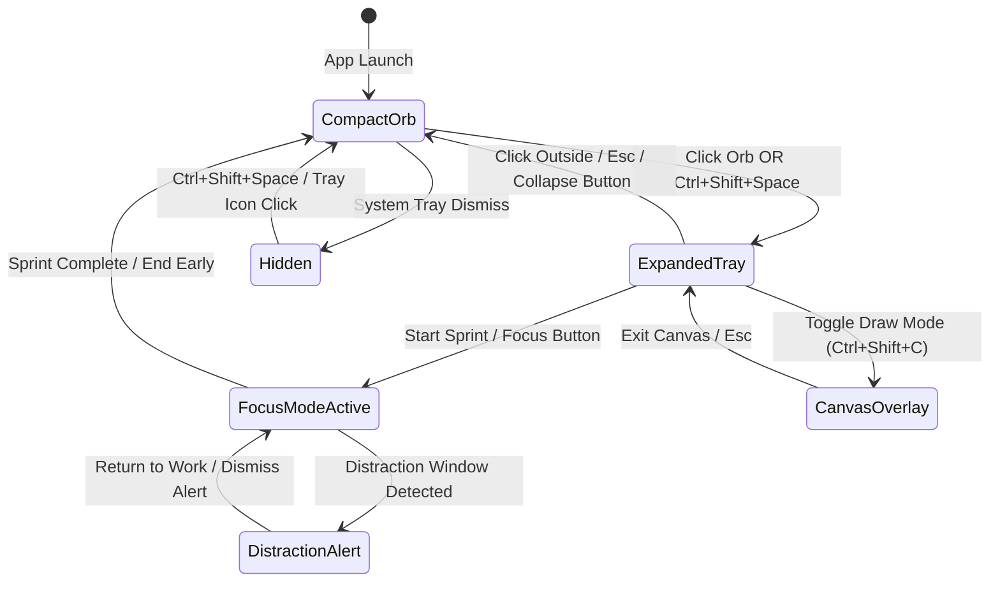
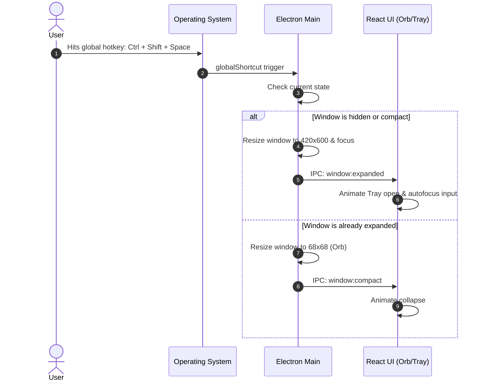
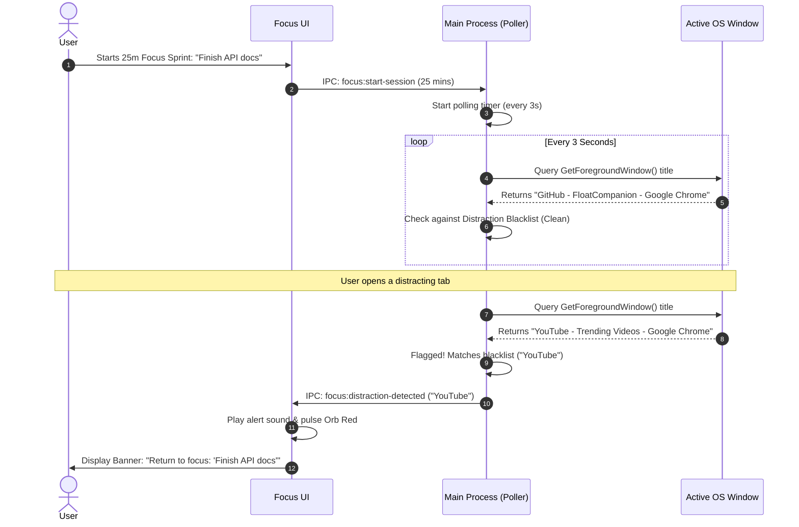

# Application Flow & Lifecycle State Machine — FloatCompanion

**Document Version:** 1.0.0  
**Scope:** Window State Transitions, User Interaction Journeys, Hotkey Routing & Flowcharts  

---

## 1. Master Window State Machine

FloatCompanion manages an Electron window that dynamically resizes and alters mouse event transparency depending on the active state.

---

## 2. Window Geometry & Interaction Matrix

| Window Mode | Dimensions | Click Behavior | Window Flags | UI Contents |
| :--- | :--- | :--- | :--- | :--- |
| **1. Compact Orb** | 68 × 68 px | Clickable / Draggable | `alwaysOnTop: true`, `transparent: true`, `frame: false` | Glowing pulsating orb, status dot, subtle badge. |
| **2. Expanded Tray** | 420 × 600 px | Interactive | `alwaysOnTop: true`, `transparent: true`, `focusable: true` | Chat input, message thread, tab bar (Chat, Tasks, Stats, Settings). |
| **3. Focus Mode** | 68 × 68 px (Orb) or 360 × 120 px (Bar) | Interactive | `alwaysOnTop: true`, alert level elevated | Countdown timer ring, active goal name, urgency color pulse. |
| **4. Screen Canvas** | Fullscreen (1920 × 1080) | Drawing on Canvas | `alwaysOnTop: true`, `transparent: true` | Drawing toolbar (pen, highlighter, eraser, clear, export). |

---

## 3. Core User Journey Flows

### Flow 1: Global Summon & Instant Prompt

### Flow 2: Zero-Token Local Command Flow
1. User summons the tray and types: `open vscode`.
2. UI submits prompt to `fastRouter.ts`.
3. `fastRouter` identifies intent: `LOCAL_APP_LAUNCH` with param `"vscode"`.
4. UI calls `window.electronAPI.os.launchApp('vscode')`.
5. Main process resolves VS Code executable path and executes `start code` (Windows) or `open -a "Visual Studio Code"` (macOS).
6. Tray displays inline notification: *"Launched Visual Studio Code (8ms)"* and auto-collapses to Orb after 2 seconds.

### Flow 3: AI Inference & Streaming Code Execution
1. User types: `"Write a PowerShell one-liner to find the 5 largest files in C:\Users"`.
2. `fastRouter` detects complex generation request ➔ passes to AI Orchestrator.
3. Orchestrator selects primary key from Groq Key Pool.
4. Streams response token-by-token directly into UI chat stream.
5. Once code block finishes streaming, UI renders an actionable **"Run in Terminal"** and **"Copy"** button.
6. If the user clicks **"Run in Terminal"**:
   * Prompts user with confirmation modal displaying sanitized command.
   * Dispatches command to `osActionHandler.cjs` for execution.
   * Shows execution terminal output inside the chat bubble.

### Flow 4: Focus Mode (Pomodoro Guardian Flow)

---

## 4. Edge Cases & Resilience Behaviors

* **Loss of Internet Connection:**
  * When offline, all cloud AI calls failover cleanly to local Ollama if installed, or prompt the user: *"You are offline. Local Zero-Token commands (clock, storage, app launch) are still fully operational."*
* **Display Resolution / Scaling Change:**
  * When moving the Orb across displays with differing DPI scaling (e.g. 100% to 150%), the window recalculates bounds using Electron's `screen.getDisplayMatching()`.
* **Full-Screen Games or Presentations:**
  * When a full-screen application is running, FloatCompanion enters silent mode, avoiding distracting alerts or stealing window focus.
