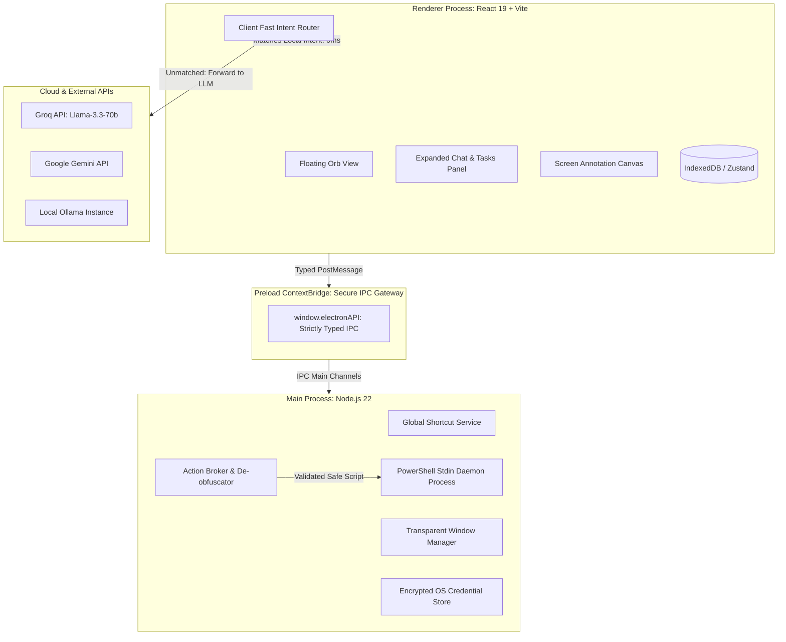
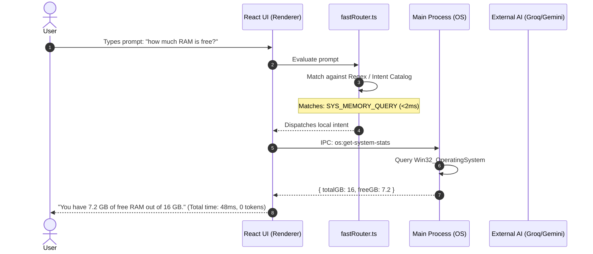
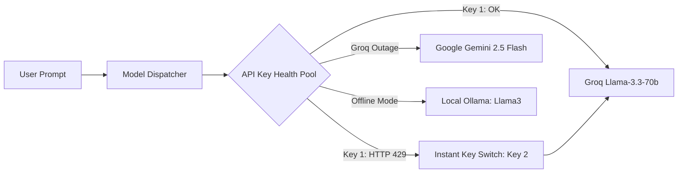

# System Architecture & Technical Design — FloatCompanion

**Document Version:** 1.0.0  
**Scope:** Distributed Multi-Process Desktop Architecture, Zero-Token Routing & OS Execution Engine  

---

## 1. High-Level Architectural Model

FloatCompanion is built upon a **Strict Multi-Process Sandboxed Model** (following modern Electron & Chromium security architecture). The application separates the high-privilege native operating system execution layer from the untrusted UI rendering layer.



---

## 2. Process Separation & Security Boundaries

### 2.1. The Renderer Process (UI Layer)
* **Configuration:**
  * `nodeIntegration: false` (strictly enforced).
  * `contextIsolation: true` (strictly enforced).
  * `sandbox: true`.
* **Responsibilities:**
  * Render the circular Orb and expanding glassmorphic tray with Tailwind and Framer Motion.
  * Run the `FastRouter` intent matcher synchronously.
  * Render Markdown, code blocks, copy buttons, and audio visualizations.
  * Maintain reactive UI state using **Zustand** and cache records in **IndexedDB**.

### 2.2. The Preload Script (The ContextBridge)
* Acts as the solitary, hardened DMZ between the Renderer and Main processes.
* Exposes a tightly scoped `window.electronAPI` interface using Electron's `contextBridge.exposeInMainWorld()`.
* **Rule:** No raw `ipcRenderer.send` or `ipcRenderer.invoke` with arbitrary strings is permitted in the UI layer. All methods must be explicitly typed functions with strict schema validation.

### 2.3. The Main Process (OS & System Controller)
* **Responsibilities:**
  * Manage Electron `BrowserWindow` creation, position, transparency (`transparent: true`), and click-through handling (`setIgnoreMouseEvents`).
  * Register the global OS hotkey (`Ctrl + Shift + Space`) via Electron's `globalShortcut`.
  * House the **OS Action Broker**: inspects active windows, executes PowerShell commands, measures hardware stats, and handles focus mode polling.

---

## 3. Subsystem 1: Deterministic Zero-Token Fast Router

The Fast Router is the first line of evaluation for every incoming prompt. It bypasses external LLMs for standard desktop utility commands.



### Routing Logic Pipeline:
1. **Normalization:** Trims whitespace, converts to lowercase, and strips leading punctuation or conversational filler (*"hey can you", "please tell me"*).
2. **Intent Matching Table:**
   * **Clock / Calendar:** `time`, `date`, `what day is it` ➔ Handled by browser `Intl.DateTimeFormat`.
   * **App Launching:** `open <app>`, `launch <app>` ➔ Sent to `os:launch-app`.
   * **System Telemetry:** `ram`, `memory in use`, `free disk space` ➔ Sent to `os:get-system-stats`.
   * **Task Lookup:** `what are my tasks`, `active sprint` ➔ Directly read from Zustand store.
   * **Document Generators:** `/pdf`, `/note` ➔ Client-side document export.
3. **Fallback:** If confidence is below threshold, routes immediately to the Multi-Model Orchestrator.

---

## 4. Subsystem 2: Multi-Model AI Orchestrator & Key Pool



### Key Pool Mechanics:
* Stores an array of API keys configured in settings.
* Maintains a health status map (`ACTIVE`, `RATE_LIMITED`, `INVALID`).
* If a provider returns HTTP status `429` (Rate Limited) or error code `resource_exhausted`, the dispatcher:
  1. Marks the offending key with a temporary cooldown timer (60s).
  2. Immediately retries the prompt with the next active key in the pool with **zero artificial backoff wait**.
  3. Seamlessly continues streaming without user interruption.

---

## 5. Subsystem 3: Multi-Tier OS Security Kernel (Defense-in-Depth)

Executing arbitrary shell commands suggested by AI or raw user input presents severe security hazards. FloatCompanion implements a 3-tier firewall before any command touches the OS:

```
[ Incoming Request to Execute OS Command ]
                   │
                   ▼
┌─────────────────────────────────────────────────────┐
│  Tier 1: Syntax De-obfuscation & Normalization      │
│  - Strip backticks (`), escape chars, and comments  │
│  - Decode Base64-encoded strings                    │
│  - Resolve environment variables and path aliases   │
└─────────────────────────────────────────────────────┘
                   │
                   ▼
┌─────────────────────────────────────────────────────┐
│  Tier 2: Blacklist & Dangerous Pattern Rejection    │
│  - Reject: Remove-Item -Recurse, del /f /s /q       │
│  - Reject: Format-Volume, diskpart, net user        │
│  - Reject: Set-ExecutionPolicy, registry writes     │
└─────────────────────────────────────────────────────┘
                   │
                   ▼
┌─────────────────────────────────────────────────────┐
│  Tier 3: Whitelist Match & Parameter Quarantine     │
│  - Only approved commands (Get-Process, start, etc.) │
│  - Execution via dedicated spawn stdin process      │
└─────────────────────────────────────────────────────┘
                   │
                   ▼
       [ Operating System Shell ]
```

---

## 6. Subsystem 4: Local-First State Persistence

* **Primary Engine:** IndexedDB via `idb-keyval` for browser/renderer persistence.
* **Storage Invariant:** Every chat message, completed task, or habit event is committed to local storage at $t=0\text{ ms}$ before any optional remote network sync occurs.
* **Schema Topology:**
  * `chats`: Store indexed by `session_id`, holding chronological turn arrays.
  * `sprints`: Active and historical Pomodoro and planning sessions.
  * `habits`: Daily focus telemetry (active work minutes, distraction triggers).
  * `settings`: User preferences, key pool, and custom hotkey bindings.
