# FloatCompanion — Final Output Goals & Definition of Done (DoD)

**Document Version:** 1.0.0  
**Scope:** North Star Vision, Complete System Deliverables, Performance SLAs & Acceptance Criteria  

---

## 🎯 1. The North Star: What Is the Final Output?

When FloatCompanion is completely built and packaged, it is **not** a website running in Chrome or a mockup—it is a **fully functional, production-ready desktop software product** for Windows (and macOS) that you can install, run, and rely on every day.

### The Concrete Final Artifacts:
1. **Desktop Installer (`FloatCompanion-Setup-1.0.0.exe`):**
   * A clean Windows NSIS installer that creates desktop & start menu shortcuts, sets up auto-launch on system startup (optional), and embeds a custom tray icon.
2. **Persistent Floating Orb:**
   * A 68×68px glassmorphic, transparent circle that docks at the edge of your primary monitor, stays on top of all windows without stealing focus, and features an interactive idle breathing glow.
3. **Instant Global Summon:**
   * Pressing `Ctrl + Shift + Space` anywhere in Windows instantly summons or dismisses the interface with zero perceptible lag (<50ms).
4. **Sub-10ms Zero-Token Local OS Control:**
   * Instant responses for machine time, memory usage, disk storage, and opening desktop apps (`open vscode`, `launch chrome`) with zero API calls and zero token expense.
5. **Ultra-Low Latency AI Copilot:**
   * Streams responses using Groq (`llama-3.3-70b`) in under 350ms, with seamless fallback to Google Gemini (`gemini-2.5-flash`) or local Ollama.
6. **Focus Guardian & Pomodoro Shield:**
   * A background daemon that polls the active window every 3 seconds. When you open YouTube, Reddit, or Twitter during a focus sprint, the Orb pulses alert-red, plays a discrete audio warning, and displays a return-to-work callout.
7. **Total Privacy & Local-First Storage:**
   * 100% of your chat transcripts, habits, API keys, and notes are saved locally in IndexedDB / OS credential vaults. No personal data leaves your machine.

---

## 🏆 2. Target Feature Matrix (Deliverable Breakdown)

```mermaid
graph TD
    Root[FloatCompanion Final Delivery] --> Shell[1. Desktop Shell]
    Root --> UI[2. Glassmorphic UI]
    Root --> Router[3. Zero-Token Router]
    Root --> AI[4. Multi-Model AI Hub]
    Root --> OS[5. Native OS Broker]
    Root --> Focus[6. Focus Guardian]
    Root --> Package[7. Release Package]

    Shell --> Shell1[Transparent Window & Drag Physics]
    Shell --> Shell2[Global Hotkey: Ctrl+Shift+Space]
    Shell --> Shell3[System Tray Minimize & Auto-start]

    UI --> UI1[Compact Orb: 68x68px]
    UI --> UI2[Expanded Tray: 420x600px]
    UI --> UI3[Markdown + Syntax Highlighted Code]

    Router --> Router1[Time & Calendar: <5ms]
    Router --> Router2[RAM & Disk Query: <60ms]
    Router --> Router3[App Launcher: <20ms]

    AI --> AI1[Groq Llama-3.3-70b Primary]
    AI --> AI2[Gemini 2.5 Flash Fallback]
    AI --> AI3[Zero-Delay Key Rotation on 429]

    OS --> OS1[PowerShell Non-blocking Stdin Daemon]
    OS --> OS2[3-Tier Security De-obfuscation Kernel]
    OS --> OS3[Type/Paste to Background Window]

    Focus --> Focus1[Active Window Title Poller: 3s]
    Focus --> Focus2[Distraction Blacklist Detection]
    Focus --> Focus3[Visual Urgency Color Palette Shift]

    Package --> Package1[Windows NSIS Installer: .exe]
    Package --> Package2[Zero-Config Setup & Settings]
```

---

## ⚡ 3. Quantitative Performance SLAs (Strict Benchmarks)

Every feature in the final output must satisfy these non-negotiable performance thresholds:

| Metric | Target SLA | Failure Threshold | Measurement Method |
| :--- | :--- | :--- | :--- |
| **Summon Hotkey Latency** | **< 45 ms** | > 100 ms | Timestamp between `globalShortcut` trigger and window `.show()` |
| **Zero-Token Router Response** | **< 10 ms** | > 30 ms | `performance.now()` from form submit to UI render for local intents |
| **Cold Startup Time** | **< 1.8 s** | > 3.0 s | From clicking `.exe` until Orb appears on screen |
| **Idle Memory Consumption (RAM)** | **< 110 MB** | > 220 MB | Task Manager `FloatCompanion.exe` private working set |
| **Groq First-Token Time** | **< 350 ms** | > 800 ms | Time to first streamed chunk on broadband connection |
| **Window Resize Animation** | **60 FPS** | < 45 FPS | Framer Motion transition between 68px Orb and 420px Tray |
| **Active Window Poller Overhead** | **< 0.5% CPU** | > 2.0% CPU | Win32 `GetForegroundWindow` CPU utilization during Focus Mode |

---

## 🛡️ 4. Security & Safety Goals

1. **Zero Destructive Command Execution:**
   * Commands like `rmdir /s /q`, `Format-Volume`, `del`, `net user`, or piping remote scripts directly to shell are mathematically blocked by the Security Kernel.
2. **Context Isolation & Sandboxing:**
   * Chromium renderer strictly configured with `nodeIntegration: false` and `contextIsolation: true`.
3. **No Credential Exposure:**
   * API keys stored in encrypted local storage; keys are never reflected back into chat prompts or transmitted to analytics endpoints.

---

## 📋 5. Definition of Done (DoD) Verification Checklist

Before declaring the project complete, the application must pass all 10 acceptance tests:

- [ ] **Test 1 (Global Summon):** Press `Ctrl + Shift + Space` while playing a YouTube video or coding in VS Code. The Orb summons instantly without crashing or freezing background audio.
- [ ] **Test 2 (Drag & Snap):** Click and drag the Orb across dual monitors. It moves fluidly with zero lag and snaps neatly to screen boundaries.
- [ ] **Test 3 (Zero-Token Clock):** Type `"what time is it"` or `"date"`. Answer appears in <10ms without an internet connection.
- [ ] **Test 4 (Zero-Token System Stats):** Type `"how much RAM is in use"`. Output returns exact GB and percentage corresponding with Windows Task Manager.
- [ ] **Test 5 (App Launcher):** Type `"open notepad"` or `"launch calculator"`. Windows opens the application. If already running, brings it to the foreground.
- [ ] **Test 6 (AI Streaming):** Type a complex coding question. Groq streams syntax-highlighted code in under 400ms with working "Copy Code" button.
- [ ] **Test 7 (Auto Key Rotation):** Simulate a 429 rate limit error on Key #1. The system seamlessly continues the response using Key #2 with zero user intervention.
- [ ] **Test 8 (Focus Mode Guardian):** Start a 15-minute Pomodoro sprint named `"Write Unit Tests"`. Open Reddit or YouTube in Chrome. Within 3 seconds, the Orb pulses red, plays an alert chime, and presents a redirection dialog.
- [ ] **Test 9 (Local Persistence):** Close the app, restart your PC, and reopen. All previous chat sessions, tasks, and settings are preserved intact from IndexedDB.
- [ ] **Test 10 (Standalone Installer):** Execute `npm run pack:win`. The resulting `.exe` installs cleanly on a fresh Windows machine without requiring Node.js or Git pre-installed.
