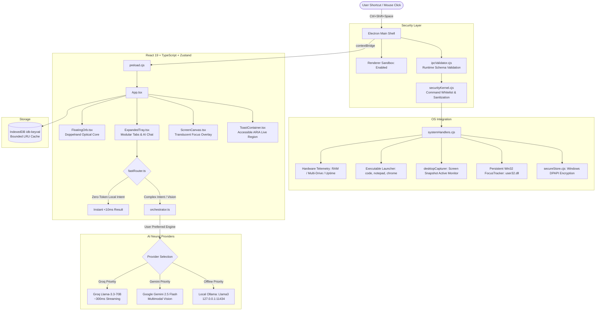

<div align="center">

# 🔮 FloatCompanion
### Autonomous Floating AI Desktop Companion & Focus Guardian

> *A persistent, lightweight desktop copilot inspired by FloatGPT and Raycast. FloatCompanion hovers seamlessly over your IDE, terminal, and browser — offering sub-300ms neural streaming, 1-click desktop screen vision, hands-free voice dictation, zero-token local OS control, hardware-encrypted credential vaults, and proactive distraction shielding.*

[](https://github.com/Lohith-RC/float-companion/releases)
[](https://www.electronjs.org/)
[](https://react.dev/)
[](https://www.typescriptlang.org/)
[](https://tailwindcss.com/)
[](./LICENSE)
[]()

<br />

[💡 What Is It?](#-what-am-i-building-the-core-identity) •
[🔥 Why Build It?](#-why-am-i-building-it-the-pain-it-kills) •
[✨ Features](#-core-capabilities--the-8-superpowers) •
[⚡ Architecture](#-system-architecture) •
[⚔️ Comparison Matrix](#️-competitive-head-to-head) •
[⌨️ Hotkeys](#️-global-keyboard-shortcuts) •
[🚀 Quickstart](#-quickstart-guide) •
[🔒 Security & Vault](#-enterprise-security--sandbox) •
[📚 Documentation](#-repository-documentation-map)

---

</div>

## 📦 Download Desktop App & Live Demo

* **Windows 10/11 Standalone App:** 👉 **[Download FloatCompanion v1.0.0 for Windows (.zip)](https://github.com/Lohith-RC/float-companion/releases/download/v1.0.0/FloatCompanion-v1.0.0-windows-x64.zip)** *(Extract and run `FloatCompanion.exe` — no install required)*
* **All Releases & Assets:** 👉 **[GitHub Releases Page](https://github.com/Lohith-RC/float-companion/releases)**
* **In-Browser Web Simulator:** 👉 **[Launch Live Simulator](https://lohith-rc.github.io/float-companion/website/)** *(Test orb kinematics directly in your browser)*

---

## 💡 What Am I Building? (The Core Identity)

> **In One Sentence:** FloatCompanion is an ambient desktop copilot that provides instant AI assistance and zero-latency OS automation right over your active workspace, while actively defending your focus against distractions.

FloatCompanion is **not another browser tab you forget about**. It is a lightweight, 68×68px transparent physical presence on your screen that stays with you across every tool you use—hovering effortlessly over your IDE, terminal, CAD software, or browser.

```
┌─────────────────────────────────────────────────────────────────────────────┐
│                       THE 3 JOBS FLOATCOMPANION DOES                        │
├─────────────────────────┬─────────────────────────┬─────────────────────────┤
│ 1. ZERO CONTEXT-SWITCH  │ 2. LOCAL-FIRST OS       │ 3. PROACTIVE FLOW       │
│    AI ASSISTANCE        │    AUTOMATION           │    GUARDIAN             │
├─────────────────────────┼─────────────────────────┼─────────────────────────┤
│ • 1-click screen vision │ • Sub-10ms native time, │ • Win32 foreground      │
│ • Hands-free dictation  │   RAM & disk telemetry  │   window interception   │
│ • Sub-300ms neural chat │ • Whitelisted app launch│ • Acoustic warning      │
│   over your active code │ • 0 API tokens consumed │   crimson alert pulses  │
└─────────────────────────┴─────────────────────────┴─────────────────────────┘
```

---

## 🔥 Why Am I Building It? (The Pain It Kills)

Modern computer workflows are **deeply fragmented**, forcing you into constant context switching that destroys deep work:

### 1. Eliminating the "Alt-Tab Browser Trap"
* **The Normal Way:** You hit a bug or syntax issue while writing code. You Alt-Tab over to Chrome to ask ChatGPT or Claude. While the page loads, you see an unread YouTube notification or an open social tab. 25 minutes evaporate into a rabbit hole, and your cognitive flow state is obliterated.
* **The FloatCompanion Way:** Tap `Ctrl + Shift + Space` or click the floating orb. The HUD glides open right over your code editor. Snap your screen with `📷` or speak with `🎙️`, receive instant streaming answers, and press `Esc`. **You never leave your workspace, and your attention stays unbroken.**

### 2. Bridging the Gap Between AI and Your Physical Computer
* Most AI tools are trapped in the cloud—they don't know your machine's hardware status, can't launch executables, and charge tokens for basic queries.
* FloatCompanion is **hybrid local-first**: asking for memory (`ram`), drive health (`disk`), or app launching (`open vscode`) executes natively on your operating system in `<10ms` with **zero token billing and zero network latency**.

### 3. Ending the Era of "Passive Timers"
* Phone Pomodoro timers and web countdowns are completely passive—you can easily ignore them and browse Reddit anyway.
* FloatCompanion is an **active guardian**. Using native Win32 foreground window APIs (`user32.dll`), it actively monitors your active app. If you drift into a distraction (YouTube, Reddit, Twitter, Netflix) during an active sprint, the orb pulses crimson and triggers an acoustic alarm to snap you back into flow.

---

## ✨ Core Capabilities — The 8 Superpowers

```
┌─────────────────────────────────────────────────────────────────────────────┐
│                            FLOATCOMPANION MODES                             │
├─────────────────────────┬─────────────────────────┬─────────────────────────┤
│    1. COMPACT ORB       │    2. EXPANDED TRAY     │    3. SCREEN CANVAS     │
│       (68 x 68px)       │      (440 x 620px)      │      (Full Screen)      │
│  • Doppelrand bezel     │  • AI Chat & Vision     │  • Translucent overlay  │
│  • Acoustic sonar pulse │  • Focus Pomodoro board │  • Focus spotlighting   │
│  • Dual-zone drag & tap │  • Multi-drive OS stats │  • Shortcut: Ctrl+Sh+C  │
└─────────────────────────┴─────────────────────────┴─────────────────────────┘
```

### 1. 🔮 The Doppelrand Optical Orb
* Compact 68×68px floating glassmorphic circle docked to your screen edge.
* Dual-ring machined bezel ("Doppelrand"), specular top arc reflections, rotating caustic sheen, and expanding ambient acoustic sonar pulse waves.
* **Dual-Zone Ergonomics:** Outer 14px ring acts as a smooth window drag region across displays, while the inner 44px optical core responds to click-to-expand.
* Stays seamlessly on top of full-screen IDEs and terminals without stealing focus.

### 2. ⚡ Zero-Token Deterministic Router
* Local regex & AST matcher intercepts native queries before touching any network API:
  * `time` / `date` $\to$ Instant machine clock formatting (`<5ms`).
  * `ram` / `memory` $\to$ Real-time RAM total, used, free GB, and utilization % (`<15ms`).
  * `disk` / `storage` $\to$ Win32 logical disk capacity and free headroom for all drives (`<50ms`).
  * `open <app>` $\to$ Whitelisted app execution with argument parsing (`code`, `notepad`, `calc`, `chrome`, etc.) (`<20ms`).

### 3. 🧠 Dual-Engine Neural Hub with Provider Priority
* **User-Selected Priority:** Dynamically routes prompts to your preferred engine (Groq, Gemini, or local Ollama) with transparent automatic fallback.
* **Ultra-Fast Inference:** Groq Cloud running **Llama-3.3-70B-Versatile** delivering streaming tokens in `<350ms`.
* **Multimodal Vision Engine:** Google **Gemini 2.5 Flash** for rapid screen snapshot understanding and complex document analysis.
* **Offline Local LLM:** Direct integration with local **Ollama** (`127.0.0.1:11434`) for air-gapped coding assistance.

### 4. 👁️ 1-Click Desktop Screen Vision
* Tap the `📷` camera button in the tray to invoke Electron's `desktopCapturer`.
* Encodes the active display into a high-density JPEG buffer (`max 1920x1080`).
* Seamlessly attaches thumbnail previews to the chat bar for instant visual query answering.

### 5. 🎙️ Hands-Free Voice Dictation
* Tap the `🎙️` microphone button to dictate prompts hands-free using the browser Web Speech API.
* Real-time pulsing audio ring indicates active voice listening. Auto-appends spoken text to the active prompt.

### 6. 🛡️ Persistent Win32 Attention Guardian
* Compiles a single persistent background `FocusTracker` using Windows `user32.dll` (`GetForegroundWindow` / `GetWindowThreadProcessId`).
* Zero process spawn churn (eliminates spawning 1,200 PowerShell processes/hour).
* Ignores minimized background apps and FloatCompanion itself; only alerts when the user actively shifts focus to blacklisted distraction windows.
* Records total distraction counts per sprint and saves records to local IndexedDB.

### 7. 🔒 Hardware-Encrypted Credential Vault
* API keys are **never** stored in plaintext.
* Integrates Electron `safeStorage.encryptString()` backed by the Windows Data Protection API (DPAPI).
* Hardware-bound credentials cannot be extracted even if the database is read directly from disk.

### 8. ♿ Production-Grade a11y & Crash-Proofing
* Built with 100% semantic HTML elements (`<button type="button">`, proper ARIA checked states, accessible live status regions).
* Multi-drive storage visualizer supporting `C:`, `D:`, `E:` with color-coded headroom bars.
* Zero blocking `alert()` dialogs; replaced by non-blocking, auto-dismissing toast notifications.
* Zero `any` types across the entire TypeScript codebase.
* Strict modular architecture ensuring all components remain **under 400 lines of code**.

### 9. 🐙 Free Native GitHub OAuth & Developer Profile (RFC 8628)
* **100% Free Forever:** Built on official GitHub OAuth 2.0 Device Authorization Grant—no backend servers, external proxies, or subscriptions required.
* **1-Click Seamless Login:** Generates a secure one-time verification code, opens GitHub in your browser, and auto-detects approval in the background.
* **Personalized Experience:** Displays your verified GitHub avatar, `@handle`, public repository count, and bio in the Tray Header and onboarding view.
* **DPAPI Vault Security:** OAuth bearer tokens are protected with Windows Data Protection API (DPAPI) hardware encryption. Also supports direct Personal Access Tokens (PAT).

---

## ⚔️ Competitive Head-to-Head

| Feature | 🔮 FloatCompanion | ⚡ Raycast | 💬 FloatGPT | 🤖 ChatGPT Desktop | 🧠 Claude Desktop |
| :--- | :---: | :---: | :---: | :---: | :---: |
| **Form Factor** | **Floating Glass Orb + Tray** | Command Spotlight | Web / Electron | Standard App Window | Standard App Window |
| **Always-on-Top Floating** | **Yes (Zero-focus steal)** | ❌ (Spotlight modal) | Partial | ❌ | ❌ |
| **Zero-Token Local OS Execution** | **Yes (<10ms)** | Extensions only | ❌ (All LLM) | ❌ (All LLM) | ❌ (All LLM) |
| **Multimodal Screen Vision** | **Yes (1-Click Snapshot)** | ❌ | ❌ | Partial (Plus only) | ❌ |
| **Hands-Free Voice Dictation** | **Yes (Native STT)** | ❌ | ❌ | Yes | ❌ |
| **Persistent Win32 Attention Guardian** | **Yes (user32.dll foreground)** | ❌ | ❌ | ❌ | ❌ |
| **Hardware Key Encryption (DPAPI)**| **Yes (safeStorage)** | ❌ (Keychain plugin) | ❌ (Plaintext) | Proprietary Server | Proprietary Server |
| **API Pricing Model** | **BYOK (Free Tier / Groq / Gemini)** | $8/mo Pro | Monthly Subscription | $20/mo Plus | $20/mo Pro |
| **Privacy / Local-First History** | **100% On-Device (IndexedDB)** | Cloud sync | Cloud DB | Cloud DB | Cloud DB |

---

## ⚡ System Architecture



---

## ⌨️ Global Keyboard Shortcuts

| Shortcut | Action | Scope |
| :--- | :--- | :--- |
| <kbd>Ctrl</kbd> + <kbd>Shift</kbd> + <kbd>Space</kbd> | **Summon / Collapse FloatCompanion** | Global (Anywhere in OS) |
| <kbd>Ctrl</kbd> + <kbd>Shift</kbd> + <kbd>E</kbd> | **Highlight-to-Ask (Instant Explain Active Selection)** | Global (Anywhere in OS) |
| <kbd>Ctrl</kbd> + <kbd>Shift</kbd> + <kbd>F</kbd> | **Instant 25m Focus Sprint Toggle** | Global (Anywhere in OS) |
| <kbd>Ctrl</kbd> + <kbd>Shift</kbd> + <kbd>C</kbd> | **Toggle Fullscreen Transparent Canvas** | Global (Anywhere in OS) |
| <kbd>Escape</kbd> | **Collapse Tray / Canvas to Orb** | In-App |
| <kbd>Enter</kbd> or <kbd>Ctrl</kbd> + <kbd>Enter</kbd> | **Send Chat Message** | Chat Input Bar |
| <kbd>Tab</kbd> + <kbd>Enter</kbd> / <kbd>Space</kbd> | **Full Keyboard a11y Navigation** | Anywhere in App |

---

## 💬 Zero-Token Commands Reference

Type these commands directly into the prompt bar for instantaneous local responses without consuming API tokens:

| Command | Action Executed | Typical Latency |
| :--- | :--- | :---: |
| `time` or `date` | Displays local time, day of week, and ISO calendar format | **< 3ms** |
| `ram` or `memory` | Inspects OS total RAM, utilized memory, free GB, and usage % | **< 15ms** |
| `disk` or `storage` | Inspects Win32 drive sizes and free capacity for all drives | **< 50ms** |
| `open vscode` | Launches Visual Studio Code (`code`) | **< 20ms** |
| `open notepad` | Launches Windows Notepad (`notepad.exe`) | **< 20ms** |
| `open calc` | Launches Calculator (`calc.exe`) | **< 20ms** |
| `open chrome` | Launches Google Chrome browser (`chrome.exe`) | **< 25ms** |
| `open terminal` | Launches Windows Terminal (`wt.exe`) | **< 25ms** |
| `open settings` | Opens Windows System Settings (`ms-settings:`) | **< 25ms** |
| `clear` | Clears all current chat messages from the active session | **< 5ms** |

---

## 🚀 Quickstart Guide

### 1. Prerequisites
* **Node.js**: v18.0.0 or later (v20+ LTS recommended)
* **npm** or **pnpm**
* **Operating System**: Windows 10/11 or macOS 12+

### 2. Installation
```bash
# Clone the repository
git clone https://github.com/Lohith-RC/float-companion.git
cd float-companion

# Install dependencies
npm install
```

### 3. API Key Configuration (Optional)
> 💡 *Note: Zero-token local commands (`time`, `ram`, `open vscode`, etc.) work completely without any API keys!*

To activate live AI responses and multimodal vision:
1. Launch FloatCompanion (`npm run dev`).
2. Click the **Settings ⚙️** icon in the header.
3. Paste your free **[Groq API Key](https://console.groq.com/keys)** (for Llama-3.3-70B) or **[Google Gemini Key](https://aistudio.google.com/app/apikey)** (for Gemini 2.5 Flash Vision).
4. Select your preferred engine (Groq, Gemini, or Local Ollama).
5. Keys are automatically encrypted with Windows DPAPI and stored safely.

*(Alternatively, copy `.env.example` to `.env` and fill in `VITE_GROQ_API_KEY` and `VITE_GEMINI_API_KEY`)*.

### 4. Development & Running
```bash
# Launches Vite development server + Electron shell concurrently
npm run dev
```

### 5. Packaging & Standalone Desktop Installers
```bash
# Verify TypeScript strict type-checking
npm run typecheck

# Build Windows NSIS (.exe) installer
npm run pack:win

# Build macOS DMG (.dmg) installer
npm run pack:mac
```

---

## 🔒 Enterprise Security & Sandbox

FloatCompanion is built with defense-in-depth security principles:

1. **Renderer Sandbox Enabled:** Chromium renderer runs with `sandbox: true`, preventing renderer exploits from escaping into node capabilities.
2. **IPC Runtime Schema Validation:** Every payload crossing the context bridge into Node.js is strictly validated using schema rules in [`electron/ipcValidator.cjs`](./electron/ipcValidator.cjs). Invalid structures are rejected before execution.
3. **Execution Whitelisting & Input Sanitization:** App launches in `os:launch-app` enforce a strict regex whitelist (`^[a-zA-Z0-9_\-\.:\s]+$`) and length bounds to eliminate command injection.
4. **Hardware-Backed Credential Vault:** Keys saved in Settings are encrypted with Windows DPAPI (`safeStorage.encryptString()`) in [`electron/secureStore.cjs`](./electron/secureStore.cjs), preventing plaintext disk compromise.
5. **Strict Content Security Policy (CSP):** `index.html` restricts scripts, styles, and network calls solely to authorized AI endpoints (`api.groq.com`, `generativelanguage.googleapis.com`).
6. **Hyperlink Quarantining & Protocol Whitelisting:** External navigation is blocked (`will-navigate`); only verified `https:` and `http:` URLs can be opened via `shell.openExternal`.
7. **Local-Origin Media Permissions:** Media permissions are restricted exclusively to trusted local application origins.

---

## 📚 Repository Documentation Map

Explore comprehensive technical specifications across every subsystem:

* 📄 [PRD.md](./PRD.md) — Product Requirements, User Personas, Feature Scope & Acceptance Criteria.
* 🏛️ [ARCHITECTURE.md](./ARCHITECTURE.md) — Process Isolation, Electron Security & Subsystem Coordination.
* 🔄 [APPFLOW.md](./APPFLOW.md) — UI State Machines, Window Geometries & Interaction Flows.
* 🔌 [IPC_API.md](./IPC_API.md) — Exhaustive Specification of all Electron IPC Channels & Payloads.
* 🧠 [MEMORY.md](./MEMORY.md) — IndexedDB Storage, Habit Tracking & Context Compression.
* 📜 [RULES.md](./RULES.md) — Coding Standards, Type Safety Rules & Architectural Invariants.
* 🛡️ [SECURITY.md](./SECURITY.md) — Multi-Tier Security Kernel, Threat Modeling & DPAPI Architecture.
* 🎯 [GOALS.md](./GOALS.md) — Definition of Done (DoD), Deliverables & SLA Acceptance Metrics.
* 🛠️ [DEVELOPMENT.md](./DEVELOPMENT.md) — Developer Setup, Transparent Window Debugging & Packaging.
* 🗺️ [ROADMAP.md](./ROADMAP.md) — Milestones, Changelog & Future Roadmap.

---

## ⚖️ License & Acknowledgments

Distributed under the **MIT License**. See [`LICENSE`](./LICENSE) for more details.  
Built with passion for high-focus developers and ambient desktop computing.
