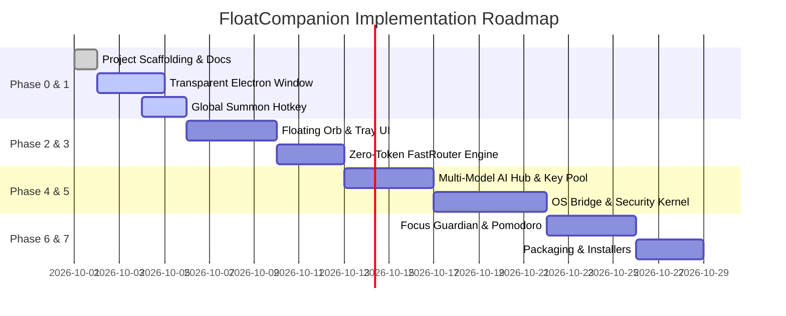

# Implementation Roadmap & Milestone Tracker — FloatCompanion

**Document Version:** 1.0.0  
**Status:** In Progress  

---

## 📌 Milestone Overview

---

## 📋 Detailed Milestone Checklist

### Phase 0: Project Scaffolding & Specifications
- [x] Create project documentation: `README.md`, `PRD.md`, `ARCHITECTURE.md`, `APPFLOW.md`, `IPC_API.md`, `MEMORY.md`, `RULES.md`, `SECURITY.md`, `DEVELOPMENT.md`, `ROADMAP.md`.
- [ ] Initialize `package.json` with dependencies (Electron, React, Vite, Tailwind CSS, Framer Motion, Zustand, Lucide React).
- [ ] Setup `tsconfig.json` and Tailwind CSS configuration.
- [ ] Setup `.env.example`.

### Phase 1: Transparent Desktop Shell & Hotkeys
- [ ] Create `electron/main.cjs` with frameless, transparent window setup.
- [ ] Implement smooth window resizing logic between compact Orb (68x68) and expanded Tray (420x600).
- [ ] Register global shortcut `Ctrl + Shift + Space` using Electron's `globalShortcut`.
- [ ] Implement system tray icon with menu (Show, Hide, Quit).

### Phase 2: Floating Orb & Expandable Tray UI
- [ ] Build circular Orb UI with glowing border and subtle idle breathing animation.
- [ ] Implement draggable physics using pointer events.
- [ ] Build Expandable Tray UI containing:
  - Header with minimize/collapse button and status indicator.
  - Chat stream with Markdown and code syntax highlighting.
  - Text input with auto-resize and voice input button.
  - Tab navigation (Chat, Sprint Tasks, System Stats, Settings).

### Phase 3: Zero-Token FastRouter
- [ ] Implement `src/ai/fastRouter.ts` with regex intent matcher.
- [ ] Local clock and calendar formatter.
- [ ] Local system stats handler (`ram`, `disk`).
- [ ] Local app launcher intent mapping (`open <app>`).
- [ ] Instant document export shortcuts (`/pdf`, `/note`).

### Phase 4: Multi-Model AI Hub & Streaming
- [ ] Implement Groq API provider (`llama-3.3-70b-versatile`) with streaming tokens.
- [ ] Implement Google Gemini API provider (`gemini-2.5-flash`).
- [ ] Build dynamic API Key Pool with 0ms automatic rotation on HTTP 429 errors.
- [ ] Implement conversation context pruning and token optimizer in `src/ai/contextCompressor.ts`.

### Phase 5: Native OS Action Bridge & Security Kernel
- [ ] Implement `electron/securityKernel.cjs` for command de-obfuscation and blacklist filtering.
- [ ] Build PowerShell stdin runner process for safe read-only queries and window activation.
- [ ] Implement app launcher with executable alias resolver.
- [ ] Build background window typing / clipboard paste action.

### Phase 6: Focus Guardian & Habit Analytics
- [ ] Implement background active window title poller (3-second interval).
- [ ] Match active window titles against configurable distraction blacklist.
- [ ] Build visual urgency pulse alerts and banner notifications.
- [ ] Implement local Pomodoro sprint timer with audio chime.
- [ ] Build Habit Analytics view showing completed focus sessions.

### Phase 7: Polish & Distribution
- [ ] Comprehensive error handling and offline state messaging.
- [ ] Windows NSIS packaging (`npm run pack:win`).
- [ ] macOS DMG packaging (`npm run pack:mac`).
- [ ] End-to-end smoke testing.
